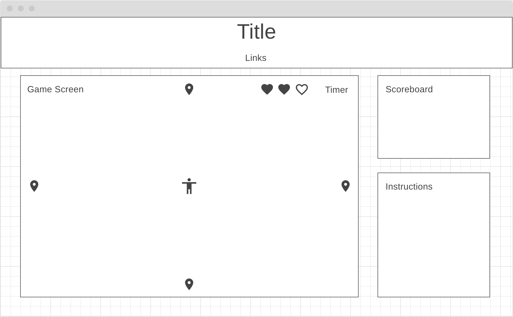

# wizard world

[Link to game](https://yinglzhou.github.io/wizard-world/)

## Description:
**wizard world** is a top-down shooter game that follows a young wizard in his journey to defeat evil enemies and restore peace to the wizarding world. The player starts out in the center of the map and can move around using their arrow keys. Enemies will spawn from entrance points on the sides of the map. The player can use their WASD keys to shoot bullets in the corresponding directions. The goal of each level is to stay alive until the time runs out. 


## Controls:
Player movement is controlled via the arrow keys.  
The direction that the fireballs are shot in are controlled with the WASD keys.  


## Technologies, Libraries, APIs:
wizard world is coded entirely in vanilla Javascript. The game is updated using the setInterval function and is rendered on a canvas element.

The following technologies will be implemented:
- `Canvas API` for rendering the map, player, and enemies.
- `Webpack` for bundling and transpiling JavaScript Code.
- `npm` for managing dependencies

## Feature Implementation:
The score panel on the right side updates as a bullet collides with an enemy. 
``` javascript
    function printScore() {
        const score = document.getElementById("scoreboard");
        score.innerHTML = `
        <p>
        Score: <br>
        <div>
        ${a.score}
        </div>
        </p>
        `
    }

    function collisionCheck () {
        for (let b = 0; b < a.bullets.length; b++) {
            let bullet = a.bullets[b];
            for (let e = 0; e < enemies.length; e++) {
                let enemy = enemies[e];
                const dx = bullet.posx - enemy.posx - 16;
                const dy = bullet.posy - enemy.posy - 24;
                const distance = Math.sqrt((dx * dx) + (dy * dy));
                if (distance < 7 + 30.75/2) {
                    a.bullets.splice(b, 1);
                    enemies.splice(e, 1);
                    a.score++;
                    break;
                }
            }
        }
    }
```
When the player shoots a bullet with the WASD keys, the bullets move in the corresponding directions.
``` javascript
    shoot(key) {
        let dx;
        let dy;
        const bullX = this.posX + 16;
        const bullY = this.posY + 24;
        if (this.keyPressed === true) {
            if (key === "KeyD") {
                let dx = 5;
                let dy = 0;
                const bullet = new Bullet(bullX, bullY, dx, dy);
                this.bullets.push(bullet);
            }
            if (key === "KeyA") {
                let dx = -5;
                let dy = 0;
                const bullet = new Bullet(bullX, bullY, dx, dy);
                this.bullets.push(bullet);
            }
            if (key === "KeyW") {
                let dx = 0;
                let dy = -5;
                const bullet = new Bullet(bullX, bullY, dx, dy);
                this.bullets.push(bullet);
            }
            if (key === "KeyS") {
                let dx = 0;
                let dy = 5;
                const bullet = new Bullet(bullX, bullY, dx, dy);
                this.bullets.push(bullet);
            }
        }

    }
```
The enemies speed will inscrease when the player's score obtains 5 points and once again when they obtain 15 points.
``` javascript
    function updateEnemy() {
        if (a.score >= 5) {
            enemies.forEach((enemy) => {enemy.moveToPlayer(1.1)})
        }
        if (a.score >= 15) {
            enemies.forEach((enemy) => {enemy.moveToPlayer(1.15)})
        }
        enemies.forEach((enemy) => {enemy.moveToPlayer()})
    }
```

## Wireframe:

- The title/banner will display the name of the game. 
    - To the right of the title, there will be links to Github and LinkedIn.
- In the game screen, the player's spawn position is represented as the little man in the center. 
    - The possible spawn locations of enemies are represented with the little geo markers. 
    - The timer for every level will be displayed at the top right corner of the game screen. 
    - On the left of the timer, there will be little hearts indicating how many lives the player has.
- Towards the right, there will be a panel for basic instructions for movement and shooting. 