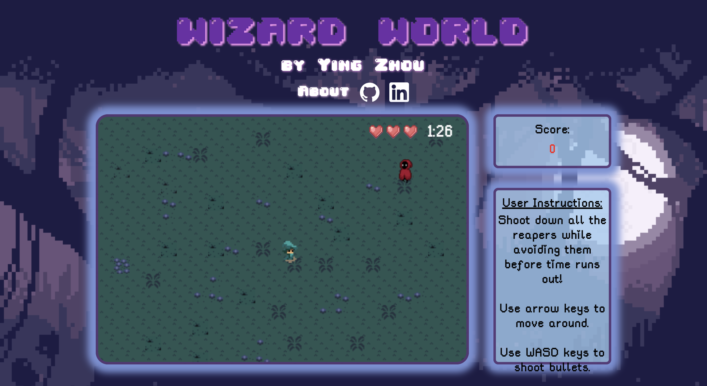
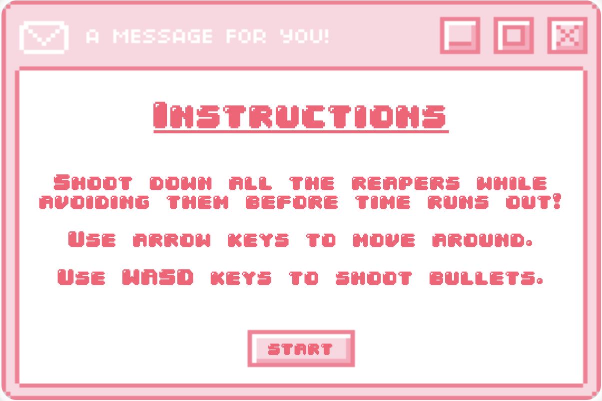

# wizard world

[Link to game](https://yinglzhou.github.io/wizard-world/)

## Description:
wizard world is a top-down shooter game that where the player's goal is to stay alive until the timer runs out. Players must defeat all the reapers that spawn with their fireballs in order to survive! 


## Controls:
Player movement is controlled via the arrow keys.  
The direction that the fireballs are shot in are controlled with the WASD keys.  

<!--  -->

## Technical:
wizard world is coded entirely in vanilla Javascript. The game is updated using the setInterval function and is rendered on a canvas element.

## Feature Implementation:
The score panel on the right side updates as a bullet collides with an enemy. 
``` javascript
    function printScore() {
        const score = document.getElementById("scoreboard");
        score.innerHTML = `
        <p>
        Score: <br>
        <div>
        ${a.score}
        </div>
        </p>
        `
    }

    function collisionCheck () {
        for (let b = 0; b < a.bullets.length; b++) {
            let bullet = a.bullets[b];
            for (let e = 0; e < enemies.length; e++) {
                let enemy = enemies[e];
                const dx = bullet.posx - enemy.posx - 16;
                const dy = bullet.posy - enemy.posy - 24;
                const distance = Math.sqrt((dx * dx) + (dy * dy));
                if (distance < 7 + 30.75/2) {
                    a.bullets.splice(b, 1);
                    enemies.splice(e, 1);
                    a.score++;
                    break;
                }
            }
        }
    }
```
When the player shoots a bullet with the WASD keys, the bullets move in the corresponding directions.
``` javascript
    shoot(key) {
        let dx;
        let dy;
        const bullX = this.posX + 16;
        const bullY = this.posY + 24;
        if (this.keyPressed === true) {
            if (key === "KeyD") {
                let dx = 5;
                let dy = 0;
                const bullet = new Bullet(bullX, bullY, dx, dy);
                this.bullets.push(bullet);
            }
            if (key === "KeyA") {
                let dx = -5;
                let dy = 0;
                const bullet = new Bullet(bullX, bullY, dx, dy);
                this.bullets.push(bullet);
            }
            if (key === "KeyW") {
                let dx = 0;
                let dy = -5;
                const bullet = new Bullet(bullX, bullY, dx, dy);
                this.bullets.push(bullet);
            }
            if (key === "KeyS") {
                let dx = 0;
                let dy = 5;
                const bullet = new Bullet(bullX, bullY, dx, dy);
                this.bullets.push(bullet);
            }
        }

    }
```
The enemies speed will inscrease when the player's score obtains 5 points and once again when they obtain 15 points.
``` javascript
    function updateEnemy() {
        if (a.score >= 5) {
            enemies.forEach((enemy) => {enemy.moveToPlayer(1.1)})
        }
        if (a.score >= 15) {
            enemies.forEach((enemy) => {enemy.moveToPlayer(1.15)})
        }
        enemies.forEach((enemy) => {enemy.moveToPlayer()})
    }
```
